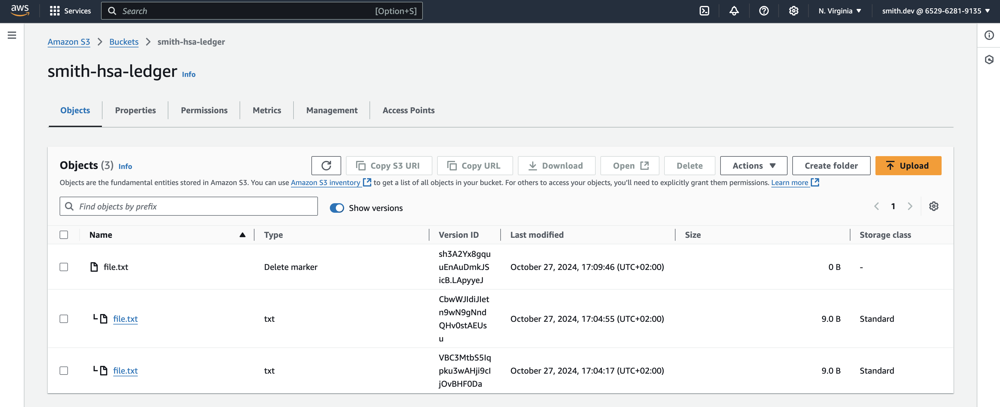
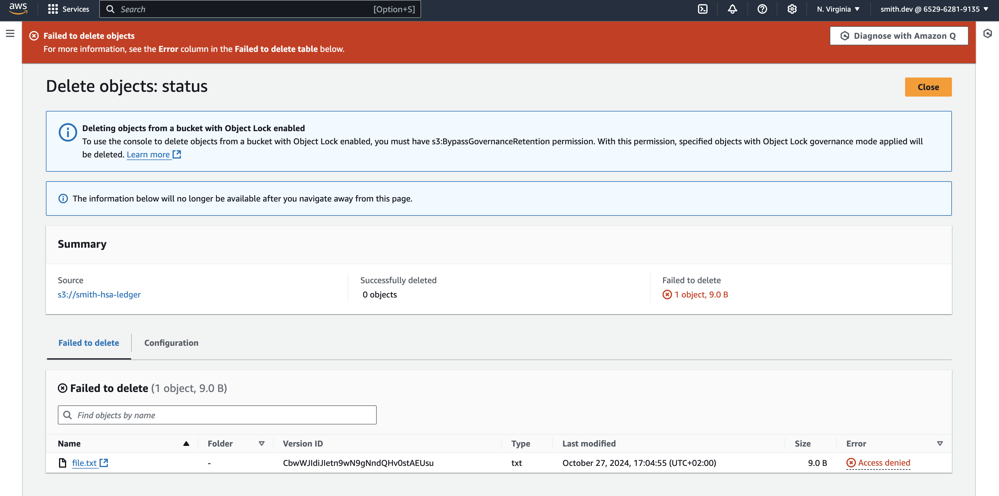
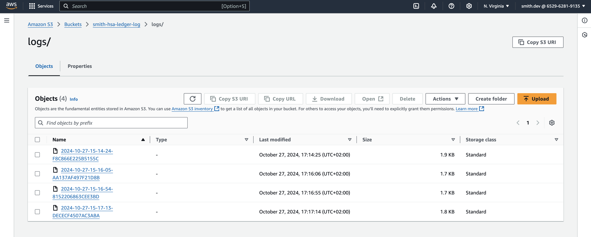

# HSA AWS S3 setup

<h3>Task</h3>

- Create bucket where objects can’t be modified and all requests are logged

<h3>Description</h3>

Prerequisites
1. Configure aws access via [AWS CLI](https://aws.amazon.com/cli/)
2. Setup [Terraform CLI](https://developer.hashicorp.com/terraform/cli)

Apply changes:
```
cd terraform
terraform init
terraform apply
terraform destroy
```

Upload several object versions, download and delete object from s3:
```
aws s3api put-object --bucket smith-hsa-ledger --key file.txt --body file.txt
aws s3api get-object --bucket smith-hsa-ledger --key file.txt output.txt
aws s3api delete-object --bucket smith-hsa-ledger --key file.txt
```

Object versioning enabled (not allows override current object):



Object locking enabled (not allows delete object versions during specified retention period):



Bucket access logs enabled:

